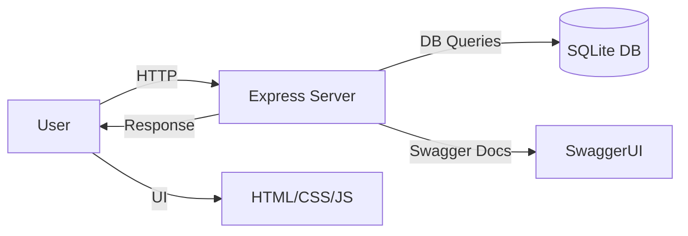
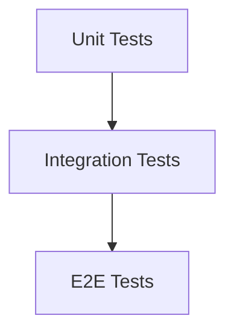

# Fullstack Test Playground

A comprehensive full-stack Node.js practice project with:
✅ Express.js backend API  
✅ SQLite + Knex.js database  
✅ Swagger/OpenAPI documentation  
✅ Unit, integration, and E2E tests (Jest, Supertest, Playwright)  
✅ Prettier, ESLint, Husky, and Trivy for formatting, linting, git hooks, and security  
✅ Page Object Model (POM) for scalable E2E testing

---

## 🚀 Features
- **Backend**: Express.js REST API with CRUD operations for user management.
- **Database**: SQLite + Knex.js with migrations and seeds.
- **Frontend**: Simple UI with Login, Dashboard, and User Management pages.
- **Validation**: Both frontend checks and backend validation of data.
- **Swagger**: Auto-generated API docs via Swagger/OpenAPI.
- **Testing**:  
  - Jest unit tests for validation logic.  
  - Supertest-powered integration tests for API endpoints.  
  - Playwright E2E tests covering full user flows with POM.  
- **Tooling**:  
  - Prettier + ESLint for code quality.  
  - Husky pre-commit hooks.  
  - Trivy vulnerability scanner.  

---

## 📂 Project Structure
```
📦 fullstack-test-playground
├── 📁 db/                 # Migrations and seeds
├── 📁 docs/               # API docs and diagrams
├── 📁 public/             # Frontend static files (HTML, CSS, JS)
├── 📁 src/                # Express app (routes, controllers, services)
├── 📁 tests/              # Unit, integration, and E2E tests
├── 📄 jest.config.js      # Jest configuration
├── 📄 knexfile.js         # Knex configuration
├── 📄 package.json        # Dependencies and scripts
├── 📄 README.md           # Project documentation
└── 📄 server.js           # Server entry point
```

---

## 🏗️ Architecture Diagram


---

## 🧪 Testing Overview
- **Unit Tests**:  
  Located in `tests/unit/`, cover validation logic.
- **Integration Tests**:  
  Located in `tests/integration/`, use Supertest to hit API endpoints.
- **E2E Tests**:  
  Located in `tests/e2e/`, use Playwright with Page Object Models.

### Testing Flow


---

## 📦 Setup Instructions
1️⃣ Clone the repository:
```bash
git clone https://github.com/yourusername/fullstack-test-playground.git
cd fullstack-test-playground
```

2️⃣ Install dependencies:
```bash
npm install
```

3️⃣ (Optional) Install Playwright browsers:
```bash
npx playwright install
```

---

## 🏃 Usage
### Start the server:
```bash
npm start
```
View API docs: [http://localhost:3000/api-docs](http://localhost:3000/api-docs)  
View UI: [http://localhost:3000](http://localhost:3000)

### Run Tests:
- **All Jest tests (unit + integration)**:  
```bash
npm test
```
- **Unit tests only**:  
```bash
npm run test:unit
```
- **Integration tests only**:  
```bash
npm run test:integration
```
- **Playwright E2E tests (headless)**:  
```bash
npm run test:e2e
```
- **Playwright E2E tests (headed)**:  
```bash
npm run test:e2e:headed
```
- **Show Playwright test report**:  
```bash
npm run test:e2e:report
```

### (Optional) Format & Lint:
```bash
npx prettier --write .
npx eslint .
```

---

## 🔒 Security
- **Trivy Security Scan** (optional):  
```bash
trivy fs .
```

---

## 📝 Roadmap
- 🔐 Add authentication (JWT, sessions)
- 🎨 Improve UI (e.g., Tailwind, Bootstrap)
- 🧹 Add pagination for user lists
- 📊 Improve test coverage
- 🏢 Deploy to cloud (Heroku, Vercel)

---

## 🏅 Final Thoughts
This project showcases a complete full-stack testing playground:
✅ Solid architecture  
✅ Robust CRUD APIs  
✅ Reliable E2E tests with Playwright  
✅ Swagger docs and code quality tools  

---

## 📜 License
MIT