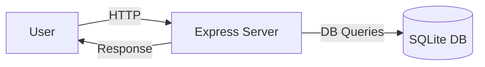
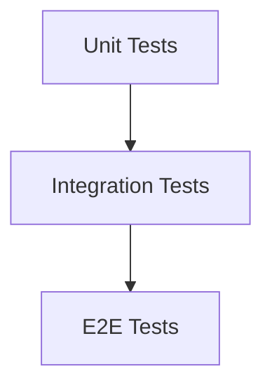

# Fullstack Test Playground

A comprehensive Node.js practice project covering unit, integration, and E2E testing. Built with Express.js, SQLite, Swagger, Jest, Supertest, Playwright, Trivy, and a Taskfile-based local workflow.

---

## 🚀 Features
- Express.js backend API
- SQLite database with Knex.js migrations and seeds
- Swagger/OpenAPI API documentation
- Jest for unit/integration tests
- Supertest for API testing
- Playwright for E2E tests
- Trivy for vulnerability scanning
- Husky for pre-commit checks
- Taskfile for local task automation
- Mermaid.js diagrams for architecture and workflow

---

## 📂 Project Structure
```plaintext
src/           # App code (controllers, services, models, routes)
db/            # Database migrations and seeds
tests/         # Unit, integration, and E2E tests
docs/          # Mermaid diagrams and Swagger info
.vscode/       # Editor config
.husky/        # Git hooks
```

---

## 🏗️ Architecture Diagram


---

## 🧪 Testing Flow


---

## 📦 Setup Instructions
1️⃣ Clone the repo:
```bash
git clone https://github.com/yourusername/fullstack-test-playground.git
cd fullstack-test-playground
```

2️⃣ Install dependencies:
```bash
npm install
```

3️⃣ Install Trivy:
```bash
brew install aquasecurity/trivy/trivy
```

4️⃣ Install Task (local task runner):
```bash
brew install go-task/tap/go-task
```

---

## 🛠️ Usage
- **Run lint**: `task lint`
- **Run unit tests**: `task test`
- **Run E2E tests**: `task e2e`
- **Scan for vulnerabilities**: `task scan`
- **Run DB migrations**: `task db:migrate`
- **Seed the DB**: `task db:seed`
- **Reset the DB**: `task db:reset`
- **Start server**: `task start`
- **Run full dev flow**: `task dev`

---

## 🔐 License
MIT